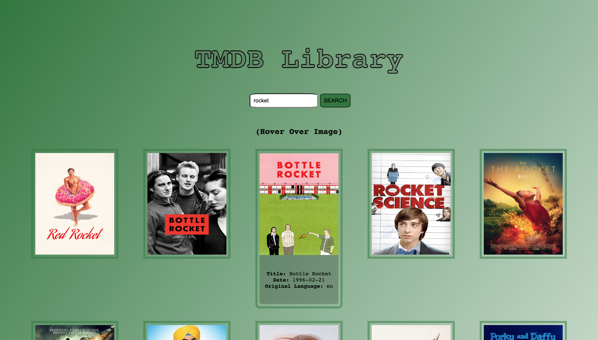

# TMDB Library

## Overview. 

This is a straightforward website, where I simply fetch information from [TMDB API](https://developers.themoviedb.org/3/getting-started/introduction) and display it on screen for the user. This was only the third "website" I'd ever built. The first two were what got me accepted into General Assembly. All things considered, I'm proud of how it turned out, if only because it was my first attempt at integrating an API into a project.

  <a href='https://www.linkedin.com/in/saman-griffiths/' target='_blank'>LinkedIn</a> | <a href='' target='_blank'>Portfolio
  </a> | <a href='https://tmdb-search.vercel.app/'>Deployed Site</a>
  

   

